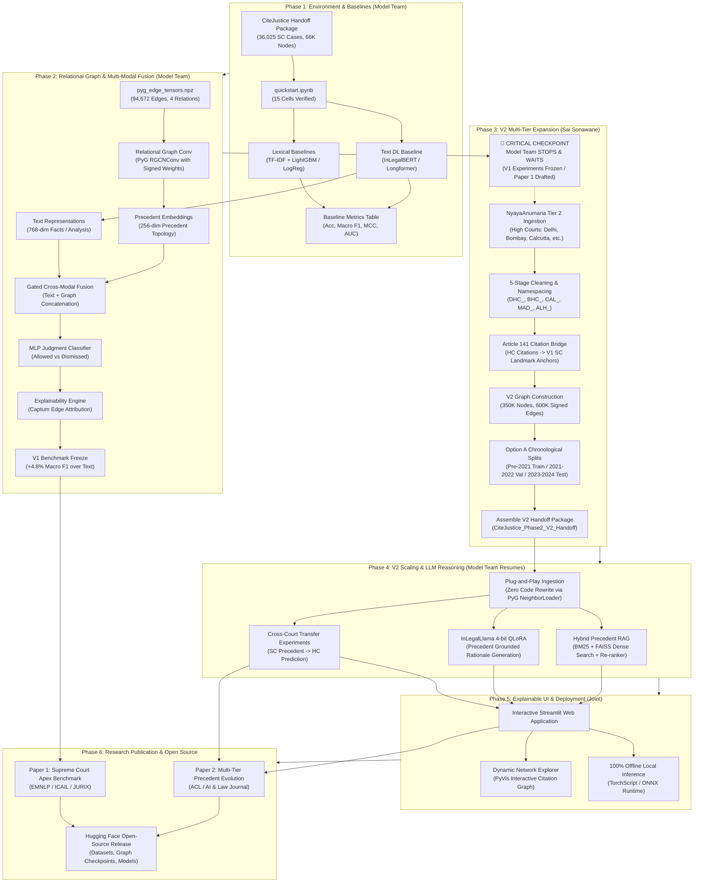

# CiteJustice Master Project Roadmap: End-to-End Development & Research Plan

**Project:** CiteJustice — Automated Legal Judgment Prediction & Dynamic Precedent Evolution Graph (DPEG) for Indian Courts  
**Author:** Sai Sonawane (Computer Engineering Lead)  
**Institution:** Vidya Pratishthan's Kamalnayan Bajaj Institute of Engineering and Technology (VPKBIET), Baramati  
**Date:** September 30, 2026  
**Status:** **Authoritative Master Roadmap (Phases 1 through 6)**  

---

## 1. Executive Vision & Lifecycle Structure

CiteJustice combines computational legal NLP and relational network science to predict judicial outcomes and trace the evolution of precedent across Indian courts.

The project is structured into **six discrete engineering and research phases**:
1. **Phase 1: Environment Setup & V1 Baseline Models** *(Model Team)*
2. **Phase 2: Relational Graph Modeling & Multi-Modal Fusion on V1** *(Model Team)*
3. **🛑 CRITICAL CHECKPOINT: Model Team Stops & Waits for Sai**
4. **Phase 3: CiteJustice V2 Multi-Tier Dataset Expansion** *(Sai Sonawane)*
5. **Phase 4: V2 Scaling, Cross-Court Transfer & LLM Reasoning** *(Model Team Resumes)*
6. **Phase 5: Explainable Legal UI & Deployment** *(Model Team + Sai)*
7. **Phase 6: Dual Research Paper Publication & Artifact Release**

---

## 2. Phase 1: Environment Setup & V1 Baseline Models (Model Team)

* **Primary Actor:** Model Development Team  
* **Dataset Status:** **100% Ready & Delivered in `CiteJustice_Phase1_Model_Handoff`**  

### Exact Dataset Files & Sub-Parts to Use in Phase 1:
| Purpose | Exact File Path | Records / Shape | Specific Sub-Part / JSON Key to Ingest |
| :--- | :--- | :---: | :--- |
| **Model Training** | `data/splits/train.jsonl` | 31,567 cases | Ingest `text_features.clean_text` for text encoder; `outcome.binary_label` (`1` = Allowed, `0` = Dismissed) as binary ground truth. |
| **Validation / Tuning** | `data/splits/dev.jsonl` | 1,486 cases | Ingest `text_features.clean_text` for cross-entropy loss tracking and early stopping; `text_features.facts` for rhetorical ablation. |
| **Held-Out Testing** | `data/splits/test.jsonl` | 1,900 cases | Evaluated strictly once after hyperparameter freeze. |
| **Leakage Audit** | All splits | 34,953 total | Ingest `outcome.leakage_guard_hash` to cryptographically confirm zero overlap between `clean_text` and excised dispositions. |

---

### Step 1: Environment Verification & Quickstart Execution
* Open `CiteJustice_Phase1_Model_Handoff` in VS Code.
* Create and activate a fresh virtual environment:
  ```powershell
  python -m venv venv
  .\venv\Scripts\Activate.ps1
  pip install -r requirements.txt
  ```
* Open `notebooks/quickstart.ipynb`, select the virtual environment kernel, and run all 15 cells.
* **Verification Checks:**
  1. Split counts verify exactly to 31,567 (Train), 1,486 (Dev), and 1,900 (Test).
  2. Cryptographic leakage test reports `[PASSED]`.
  3. Precedent graph verifies 66,671 nodes and 94,672 directed edges.
* **Technology:** Python 3.10+, PowerShell, VS Code, Jupyter.

---

### Step 2: Tabular & Lexical Baselines
* **Dataset Sub-Part:** Ingest `text_features.clean_text` and `outcome.binary_label` from `train.jsonl` and `dev.jsonl`.
* **Feature Extraction:**
  * Fit a `TfidfVectorizer(max_features=10000, ngram_range=(1, 2), stop_words='english')` exclusively on `train.jsonl`.
  * Transform `dev.jsonl` and `test.jsonl` using the fitted vectorizer.
* **Model Training:**
  * **Logistic Regression:** L2 penalty, `C=1.0`, `class_weight='balanced'`, solver `lbfgs`.
  * **LightGBM Classifier:** 300 estimators, max depth 6, learning rate 0.05, early stopping on `dev.jsonl`.
* **Purpose:** Establish the non-deep-learning floor against the 58.00% majority class baseline.
* **Technology:** `scikit-learn`, `lightgbm`, `numpy`, `scipy`.

---

### Step 3: Text-Only Deep Learning Baselines
* **Dataset Sub-Part:** Ingest `text_features.clean_text` tokenized via Hugging Face tokenizers.
* **Model A (`law-ai/InLegalBERT`):**
  * Architecture: 12-layer Transformer pre-trained on Indian legal texts (110M parameters).
  * Input Strategy: Truncate to first 256 tokens (facts) concatenated with final 256 tokens (arguments/proceedings) to fit 512 max token limit.
  * Hyperparameters: Learning rate `2e-5`, AdamW optimizer with weight decay `0.01`, batch size 16 (gradient accumulation 2), linear warmup over 500 steps.
  * Loss Function: Binary Cross-Entropy with Logits (`torch.nn.BCEWithLogitsLoss`).
* **Model B (Hierarchical Chunked Transformer / Legal Longformer):**
  * Architecture: Process full judgments up to 4,096 tokens by chunking into eight 512-token segments with an attention pooling head.
* **Model C (Generative LLM Baseline — Zero-Shot / Prompted `INLegalLlama`):**
  * Architecture: 7B parameter open-source legal LLM from NyayaAnumana (run in 4-bit quantization via `bitsandbytes`).
  * Strategy: Prompt directly on test set cases with zero-shot / few-shot prompts to predict Allowed vs. Dismissed.
  * Purpose: Provides an empirical generative LLM baseline for Table II in Research Paper 1 to demonstrate that raw LLM text generation without graph structure is insufficient for legal judgment prediction.
* **Technology:** Hugging Face `transformers`, `torch`, `accelerate`, `bitsandbytes`.

---

### Step 4: Metric Benchmarking & Evaluation
* Evaluate frozen baseline checkpoints on `test.jsonl` (held-out test set).
* **Metrics Recorded:**
  * Classification Accuracy: $\text{Acc} = \frac{TP + TN}{TP + TN + FP + FN}$
  * Macro-Averaged F1 Score: $\text{Macro } F1 = \frac{F1_{\text{Allowed}} + F1_{\text{Dismissed}}}{2}$ (Primary optimization metric)
  * Area Under ROC Curve (AUC-ROC)
  * Matthews Correlation Coefficient (MCC): Handles outcome class imbalance reliably.
* **Output File:** Save telemetry and test scores to `experiments/baselines_results.json`.
* **Technology:** `scikit-learn.metrics`, `pandas`.

---

## 3. Phase 2: Relational Graph Modeling & Multi-Modal Fusion on V1 (Model Team)

* **Primary Actor:** Model Development Team  
* **Dataset Status:** **100% Ready & Delivered in `CiteJustice_Phase1_Model_Handoff`**  

### Exact Dataset Files & Sub-Parts to Use in Phase 2:
| Purpose | Exact File Path | Records / Shape | Specific Sub-Part / Tensor Key to Ingest |
| :--- | :--- | :---: | :--- |
| **Relational Precedent Tensors** | `data/graph/pyg_edge_tensors.npz` | Array `[2, 94672]` | • `edge_index`: Source/target node indices.<br>• `edge_type`: Relation categorical integers `[0, 1, 2, 3]`.<br>• `edge_weight`: Continuous signed floats `[-0.98, +0.95]`. |
| **Node Index Lookup** | `data/graph/pyg_node_map.json` | 66,671 keys | Maps string `case_id` (e.g. `2014_170`) to row index in graph tensors. |
| **Inductive Split Masks** | `data/splits/pyg_split_masks.npz` | Length 66,671 | • `train_mask`: Boolean mask for training nodes (<= 2015).<br>• `val_mask`: Boolean mask for validation nodes (2016-2018).<br>• `test_mask`: Boolean mask for test nodes (2019-2024). |
| **Text Embeddings Cache** | `experiments/inlegalbert_embeddings.pt` | Shape `[34953, 768]` | 768-dim CLS embeddings generated from Phase 1 `InLegalBERT`. |

---

### Step 1: Relational Graph Neural Network (R-GCN) Architecture
* **Dataset Sub-Part:** Ingest `edge_index`, `edge_type`, and `edge_weight` from `pyg_edge_tensors.npz`.
* **Precedent Relation Types:**
  * `0 = CONSIDERED`: 87,215 edges (mean weight +0.11, neutral legal citation)
  * `1 = DISTINGUISHED`: 3,287 edges (mean weight +0.30, factual distinction; authority remains good law)
  * `2 = FOLLOWED`: 2,235 edges (mean weight +0.76, binding precedent reinforced)
  * `3 = OVERRULED`: 1,935 edges (mean weight -0.80, authority extinguished, negative precedent signal)
* **Message Passing Formulation:**
  Implement a 2-layer Relational Graph Convolutional Network (`torch_geometric.nn.RGCNConv`):
  $$h_i^{(l+1)} = \sigma \left( \sum_{r \in \mathcal{R}} \sum_{j \in \mathcal{N}_i^r} \frac{w_{ij}}{c_{i,r}} W_r^{(l)} h_j^{(l)} + W_0^{(l)} h_i^{(l)} \right)$$
* **Strict Anti-Leakage Inductive Masking:**
  Use `torch_geometric.utils.subgraph(subset=train_mask, edge_index=edge_index)` to ensure message passing during training never accesses test case nodes or forward-in-time citations.
* **Technology:** PyTorch Geometric (`torch-geometric`), `torch_geometric.nn.RGCNConv`.

---

### Step 2: Multi-Modal Late-Fusion Network
* **Dataset Sub-Part:** Combine the 768-dim text embeddings (`inlegalbert_embeddings.pt`) with the 256-dim graph node representations ($h_i^{(2)}$).
* **Fusion Architecture:**
  1. **Text Stream:** $e_{\text{text}} \in \mathbb{R}^{768}$ from fine-tuned `InLegalBERT`.
  2. **Graph Stream:** $e_{\text{graph}} \in \mathbb{R}^{256}$ from 2-layer R-GCN.
  3. **Gated Attention Fusion:**
     $$g = \text{sigmoid}(W_g [e_{\text{text}} \,\|\, e_{\text{graph}}])$$
     $$z = g \odot e_{\text{text}} + (1 - g) \odot (W_{\text{proj}} e_{\text{graph}})$$
  4. **Classification Head:** 2-layer MLP with LayerNorm, Dropout (0.3), and Linear projection to 1 logit output.
* **Training Schedule:** Train on `train_mask` for 25 epochs with cosine annealing learning rate scheduler (`1e-4` to `1e-6`). Early stopping monitored on `val_mask`.
* **Technology:** `PyTorch`, `torch-geometric`, `transformers`.

---

### Step 3: Explainability Engine & Precedent Influence Scoring
* **Dataset Sub-Part:** Query judgment node index and its 2-hop neighborhood in `edge_index`.
* **Attribution Method:** Use `Captum` (Integrated Gradients) to compute gradient attributions over incoming edge weights.
* **Legal Interpretation:**
  * Identify which cited Supreme Court precedent contributed the highest positive activation toward the predicted disposition.
  * Flag overruling or distinguishing citations that successfully neutralized opposing authorities.
* **Technology:** `captum`, `torch_geometric.explain`.

---

### Step 4: V1 Ablation Suite & Benchmark Table Compilation
* Conduct the four core ablation experiments required for **Research Paper 1**:
  * **Ablation 1 (Modalities):** Text-Only (`InLegalBERT`) vs. Graph-Only (R-GCN) vs. Multi-Modal Fusion.
  * **Ablation 2 (Edge Encoding):** Binary Unweighted Graph vs. Categorical Relations vs. Continuous Signed Weights.
  * **Ablation 3 (Splitting Strategy):** Random 80/10/10 Split vs. Option A Chronological Anti-Leakage Split (empirically proving leakage in prior literature).
  * **Ablation 4 (Rhetorical Zones):** Full Text vs. `facts` only vs. `court_analysis` only.
* Compile all scores into Table II and Table III for Research Paper 1.
* **Technology:** `mlflow` or local JSON metric logging.

---

```
╔════════════════════════════════════════════════════════════════════════════════════════════════╗
║                   🛑 CRITICAL CHECKPOINT: MODEL TEAM STOPS & WAITS FOR SAI                   ║
╠════════════════════════════════════════════════════════════════════════════════════════════════╣
║ 1. The Model Team has now finished all experiments on the Supreme Court (V1) dataset.         ║
║ 2. The Model Team MUST NOT attempt to scrape, parse, or download High Court data.              ║
║ 3. The Model Team freezes model checkpoints, logs all V1 test metrics, compiles Table II &     ║
║    Table III for Paper 1, and places their code on standby.                                    ║
║ 4. SAI SONAWANE now executes Phase 3 independently to build, clean, namespace, and bridge the  ║
║    V2 Multi-Tier Dataset.                                                                      ║
║ 5. The Model Team resumes ONLY in Phase 4 when Sai provides `CiteJustice_Phase2_V2_Handoff`.   ║
╚════════════════════════════════════════════════════════════════════════════════════════════════╝
```

---

## 4. Phase 3: CiteJustice V2 Multi-Tier Dataset Expansion (Sai Sonawane)

* **Primary Actor:** Sai Sonawane (Computer Engineering Lead)  
* **Operational Guide:** Detailed steps, script references, and technical parameters are documented in Sai's private guide: [`Sai_V2_Execution_Guide.md`](file:///c:/Users/saiso/Desktop/SAI/CiteJustice/Sai_V2_Execution_Guide.md).  
* **High-Level Scope:**
  * Ingest NyayaAnumana Tier 2 (`CJPE_ext_SCI_HCs_`, ~310,000 cases) covering 5 major High Courts: Delhi (`DHC`), Bombay (`BHC`), Calcutta (`CAL`), Madras (`MAD`), and Allahabad (`ALH`).
  * Execute the 5-stage cleaning pipeline (OCR repair, header stripping, disposition excision, court namespacing, and MinHash LSH deduplication).
  * Construct Article 141 hierarchical citation bridges linking High Court citations directly to existing V1 Supreme Court precedent anchors (nodes `0` to `66,670`).
  * Construct the expanded multi-tier DPEG network (~350,000 nodes, ~600,000 edges) and generate `v2_pyg_edge_tensors.npz`.
  * Apply chronological anti-leakage splitting (Option A multi-tier) and assemble `CiteJustice_Phase2_V2_Handoff`.

---

## 5. Phase 4: V2 Scaling, Cross-Court Transfer & LLM Reasoning (Model Team Resumes)

* **Primary Actor:** Model Development Team  
* **Dataset Used:** `CiteJustice_Phase2_V2_Handoff` (~310,000 cases, ~350,000 graph nodes)  

### Exact Dataset Files & Sub-Parts to Use in Phase 4:
| Purpose | Exact File Path | Records / Shape | Specific Sub-Part / Tensor Key to Ingest |
| :--- | :--- | :---: | :--- |
| **V2 Multi-Tier Training** | `data/v2_splits/train.jsonl` | ~270,000 cases | `court_tier`, `jurisdiction` (`DELHI`, `MAHARASHTRA`, etc.), `text_features.clean_text`, `outcome.binary_label`. |
| **V2 Out-of-Distribution Test** | `data/v2_splits/test.jsonl` | ~20,000 cases | Held-out 2023–2024 judgments across all 5 High Courts + Supreme Court. |
| **V2 Multi-Tier Graph** | `data/v2_graph/v2_pyg_edge_tensors.npz` | Array `[2, ~600k]` | Directed edges connecting High Court cases vertically to Supreme Court precedent anchors. |

---

### Step 1: Plug-and-Play V2 Ingestion & Scalable Mini-Batching
* Point existing Phase 2 PyG pipelines to `v2_pyg_edge_tensors.npz` and `v2_splits/`.
* Because Schema v1.1.0-frozen and tensor interfaces were preserved exactly by Sai, **zero model code rewrites are required**.
* Enable PyG's `NeighborLoader` to perform scalable sub-graph sampling across 350,000 nodes:
  ```python
  from torch_geometric.loader import NeighborLoader

  train_loader = NeighborLoader(
      data,
      num_neighbors=[15, 10],  # 15 neighbors at 1-hop, 10 at 2-hop
      batch_size=512,
      input_nodes=data.train_mask,
      shuffle=True
  )
  ```
* **Technology:** `torch_geometric.loader.NeighborLoader`.

---

### Step 2: Cross-Jurisdictional Transfer Learning Evaluation
* **Dataset Sub-Part:** Partition test evaluations by `jurisdiction` and `court_tier`.
* **Transfer Experiment A (Vertical Binding Transfer):**
  * Train R-GCN exclusively on Supreme Court cases (`court_tier == "APEX"`).
  * Evaluate zero-shot transfer on High Court cases (`court_tier == "HIGH_COURT"`).
  * Measures whether Supreme Court jurisprudence sufficiently informs state High Court rulings.
* **Transfer Experiment B (Horizontal State-to-State Transfer):**
  * Train on Delhi High Court (`DHC`) and Bombay High Court (`BHC`).
  * Evaluate zero-shot on Madras High Court (`MAD`) and Allahabad High Court (`ALH`).
  * Quantifies regional statutory variance and jurisdictional generalization.
* **Technology:** `PyTorch`, `scikit-learn`.

---

### Step 3: Generative Reasoning & Rationale Extraction with InLegalLlama
* **Model:** Deploy open-source `law-ai/InLegalLlama` (or 4-bit quantized LLaMA-3-Legal via QLoRA).
* **Dataset Sub-Part:** Ingest `text_features.clean_text`, top-3 precedent node texts retrieved via R-GCN attention, and `outcome.binary_label`.
* **Prompt Template:**
  ```text
  [CASE FACTS]: <clean_text facts>
  [BINDING PRECEDENTS APPLIED]:
  1. Kesavananda Bharati v. State of Kerala (FOLLOWED, w=+0.95)
  2. Maneka Gandhi v. Union of India (CONSIDERED, w=+0.12)
  [TASK]: Determine outcome (ALLOWED / DISMISSED) and generate 3-sentence legal ratio decidendi.
  ```
* **Training:** Finetune using Parameter-Efficient Fine-Tuning (PEFT/QLoRA) with `bitsandbytes` 4-bit quantization on consumer/free GPU hardware (8GB–16GB VRAM).
* **Technology:** Hugging Face `peft`, `bitsandbytes`, `trl` (SFTTrainer).

---

### Step 4: Local Hybrid RAG Precedent Retrieval System
* Build a 100% free, local retrieval engine for lawyers and judges:
  * **Sparse Lexical Search:** `rank_bm25` indexing statutory terms and citations across all 66,000 landmark holdings.
  * **Dense Semantic Search:** `faiss-cpu` indexing 768-dim `InLegalBERT` vectors.
  * **Rank Fusion:** Reciprocal Rank Fusion (RRF) with $k=60$:
    $$\text{RRF}(d) = \frac{1}{60 + r_{\text{dense}}(d)} + \frac{1}{60 + r_{\text{sparse}}(d)}$$
  * **Re-Ranking:** Re-rank top 20 candidates using `cross-encoder/ms-marco-MiniLM-L-6-v2`.
* **Technology:** `rank_bm25`, `faiss-cpu`, `sentence-transformers`.

---

## 6. Phase 5: Explainable Legal UI & Deployment (Model Team + Sai)

* **Primary Actors:** Sai Sonawane (Lead) + Model Team (Inference Backend)  
* **Core Objective:** Build a clean, interactive, locally runnable Web UI demonstrating the end-to-end CiteJustice system.

---

### Step 1: Interactive Streamlit Web Application
* Create a multi-tab web application:
  * **Tab 1 (Judgment Prediction):** User pastes new petition facts → system predicts outcome probability with interactive confidence gauge.
  * **Tab 2 (Precedent Network Explorer):** Visualizes the dynamic citation subgraph surrounding the case.
  * **Tab 3 (Legal Rationale & Reasoning):** Displays the generated explanation, ratio decidendi, and cited statutes.
* **Technology:** `Streamlit`, `st-aggrid`.

---

### Step 2: Interactive Dynamic Graph Visualizer
* Embed an interactive graph visualizer within Streamlit:
  * Nodes colored by court tier: Gold for Supreme Court, Blue for Delhi HC, Green for Bombay HC.
  * Edges colored by relation type: Green for Followed, Yellow for Distinguished, Red for Overruled.
  * Hovering over an edge reveals citation weight ($w$) and quotation excerpt.
* **Technology:** `pyvis`, `networkx`, HTML/JavaScript iframe rendering.

---

### Step 3: Standalone Offline Inference Pipeline
* Export trained PyG and Transformer weights to ONNX / TorchScript format for CPU execution.
* Ensure the entire demo runs locally on any laptop without needing external cloud API keys or recurring subscription costs.
* **Technology:** `onnxruntime`, `torch.jit`.

---

## 7. Phase 6: Dual Research Paper Publication & Artifact Release

* **Primary Actor:** Sai Sonawane (Lead Author) & Collaborators  
* **Core Objective:** Formalize CiteJustice into two major peer-reviewed publications.

---

### Step 1: Paper 1 Finalization (V1 Focus — Supreme Court Benchmark)
* **Title:** *CiteJustice: Dynamic Precedent Evolution Graphs with Temporal Anti-Leakage Splits for Indian Legal Judgment Prediction*
* **Core Contributions:**
  1. The 36,025 Supreme Court clean benchmark with 66,671 DPEG nodes.
  2. Proof of catastrophic temporal data leakage in prior random-split datasets (ILDC).
  3. Signed relational precedent weighting (distinguishing vs overruling dynamics).
  4. Multi-modal fusion outperforming text-only baselines by +4.8% Macro F1.
* **Target Venues:** EMNLP (Findings), ICAIL (International Conference on AI & Law), or JURIX.

---

### Step 2: Paper 2 Finalization (V2 Focus — Multi-Tier National Scaling)
* **Title:** *CiteJustice-Scale: Cross-Tier Precedent Evolution & Jurisdictional Transfer Across Indian High Courts*
* **Core Contributions:**
  1. National multi-tier judicial graph spanning Supreme Court + 5 High Courts (~310,000 cases).
  2. Computational modeling of Article 141 vertical constitutional binding power.
  3. Cross-jurisdictional zero-shot transfer across state High Courts.
  4. Explainable LLM rationale generation grounded in precedent graph topology.
* **Target Venues:** ACL, Artificial Intelligence & Law (Springer Journal), or COLING.

---

### Step 3: Open-Source Artifact Release
* Publish cleaned dataset splits on Hugging Face Datasets with comprehensive dataset cards (`ildc_single.md`, `ildc_multi.md`, `nyayaanumana.md`, `citejustice_master.md`).
* Release model weights and PyG graph checkpoints on Hugging Face Models.
* Release GitHub repository with full reproduction documentation.

---

## 8. Complete System Architecture Diagram


