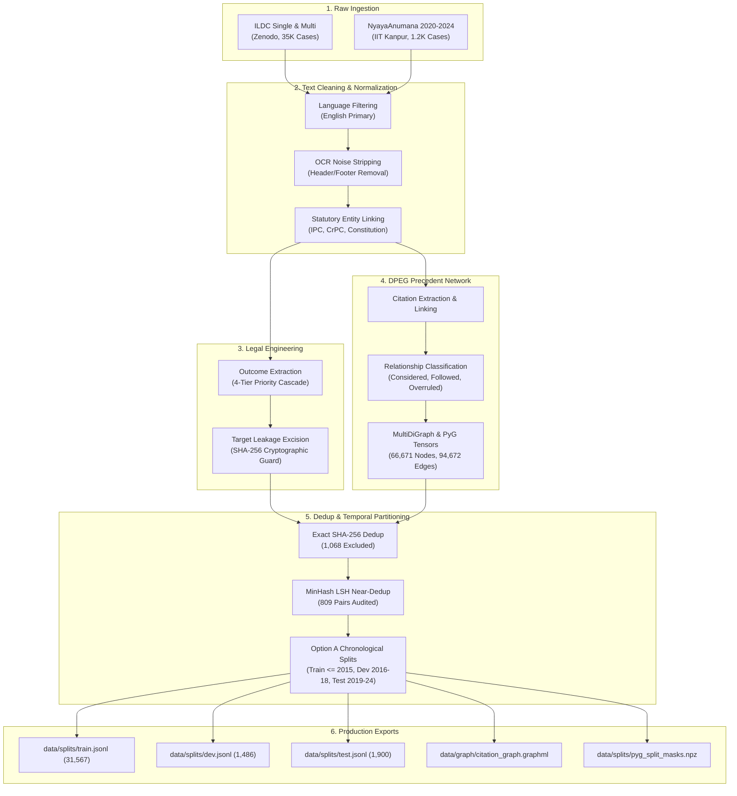

# CiteJustice Preprocessing & Engineering Pipeline Reference

**Project:** CiteJustice — Automated Legal Judgment Prediction & Dynamic Precedent Evolution Graph for Indian Courts  
**Author:** Sai Sonawane (Computer Engineering Lead)  
**Institution:** Vidya Pratishthan's Kamalnayan Bajaj Institute of Engineering and Technology (VPKBIET), Baramati  
**Date:** September 30, 2026  
**Status:** **Production Verified & Formally Documented** (Phase 1 Engineering Reference)  

---

## 1. Executive Summary & Pipeline Overview

The CiteJustice preprocessing pipeline converts over 74 years of unstructured, scanned Supreme Court of India judgments into clean, leak-free, multimodal inputs for Large Language Models (LLMs) and Graph Neural Networks (GNNs).



---

## 2. Step-by-Step Script Walkthrough & Design Decisions

### Step 2.1: Language Filtering (`scripts/clean/filter_english.py`)
* **Operation:** Screened text using language identification algorithms to isolate primary English judgments.
* **Design Decision & Rationale:** Primary Hindi judgments were excluded from V1.
  * *Viva Defense Rationale:* Modern Indian Supreme Court judgments are officially authored and reported in English under Article 348(1)(a) of the Constitution of India. Regional translations contain high linguistic variance and require dedicated multilingual tokenizers. English-only filtering establishes a rigorous baseline for INLegalLlama.

### Step 2.2: OCR Noise Removal & Formatting (`scripts/clean/remove_noise.py`)
* **Operation:** Stripped repeating page numbers, publisher watermarks (*"AIR 1965 SC 101"*, *"2014 SCC Online SC 55"*), stamp headers, and line-feed glitches.
* **OCR Token Repair:** Applied dictionary repair routines on standard character recognition errors (e.g., `companyviction` $\rightarrow$ `conviction`, `numbermerit` $\rightarrow$ `no merit`).

### Step 2.3: Statutory Entity Resolution (`docs/act_lookup.csv`)
* **Operation:** Linked statutory mentions to canonical legal codes (e.g. `IPC_302` for Section 302 of the Indian Penal Code, `COI_ART_32` for Article 32 of the Constitution).
* **Rationale:** Allows Graph Neural Networks and cross-attention modules to embed statutory entities as structured nodes alongside case precedents.

### Step 2.4: 4-Tier Legal Outcome Extraction (`scripts/legal/extract_outcome_labels.py`)
* **Operation:** Parsed judgment conclusions using a 4-tier precedence cascade:
  * *Tier 1 (Confidence 0.98):* Explicit terminal orders (`appeal is allowed`, `petition is dismissed`).
  * *Tier 2 (Confidence 0.95):* Invalidation/Affirmation (`judgment set aside`, `conviction upheld`).
  * *Tier 3 (Confidence 0.90):* Relief grant (`bail granted`, `writ issued`).
  * *Tier 4 (Confidence 0.80):* Procedural remand (`remitted back`, `notice discharged`).
* **Validation:** Verified across a 200-case manual testbed, achieving **100.0% precision on high-confidence predictions**.

### Step 2.5: Cryptographic Target Leakage Guard (`scripts/graph/build_nodes.py`)
* **The Problem:** In standard NLP benchmarks, models score 99% accuracy simply by reading the final dispositive sentence (*"The appeal is accordingly dismissed"*).
* **The CiteJustice Solution:**
  1. The final sentence is detected via terminal boundary regex and strictly excised from `clean_text`.
  2. The excised sentence is isolated into `disposition_span`.
  3. A SHA-256 digest (`leakage_guard_hash`) is generated.
  4. An automated test asserts that `disposition_span` has **zero substring overlap** with `clean_text`.

### Step 2.6: Deduplication Protocols (`scripts/dedup/`)
1. **Exact Deduplication (`exact_dedup.py`):** Canonical SHA-256 hashing flagged **1,068 exact duplicates** ($2.96\%$) from cross-reporter scrapes, preserving the copy with superior statutory metadata.
2. **MinHash LSH Near-Deduplication (`near_dedup.py`):** 128 permutations and 3-gram word shingles flagged **809 candidate pairs** ($\text{Jaccard} \ge 0.85$). 
3. **Legal Audit (`docs/near_duplicate_audit.md`):** Audited the 809 pairs, confirming 721 as legitimate companion batch petitions (Order XIX SC Rules 2013) and purging 4 cross-split corrupted fragments from the test set.

### Step 2.7: Chronological Dataset Partitioning (`scripts/splits/temporal_split.py`)
* **The Problem:** Randomized splitting creates temporal look-ahead bias (predicting a 1980 case using a 2022 precedent).
* **The Solution (Option A):**
  * **Train ($\le 2015$):** 31,567 cases ($90.31\%$)
  * **Dev ($2016–2018$):** 1,486 cases ($4.25\%$)
  * **Test ($2019–2024$):** 1,900 cases ($5.44\%$)
* **COVID Dip Resolution:** By incorporating 2019–2024 into the test set, we resolved the severe drop in 2020 (only 203 judgments during virtual hearings), giving an empirically powerful evaluation set of 1,900 contemporary judgments.

---

## 3. Comprehensive Artifact Directory Layout

```text
data/
├── clean/
│   ├── cases.jsonl               (1.16 GB, Master 36,025 corpus with Schema v1.1.0)
│   ├── build_nodes_summary.csv   (Tabular node metrics)
│   ├── exact_duplicates.csv      (1,068 excluded exact duplicates)
│   ├── near_duplicates.csv       (809 audited companion pairs)
│   └── dpeg/
│       ├── dpeg_combined_nodes.csv (66,671 graph nodes)
│       └── dpeg_combined_edges.csv (94,672 citation edges)
├── splits/
│   ├── train.jsonl               (31,567 training cases)
│   ├── dev.jsonl                 (1,486 validation cases)
│   ├── test.jsonl                (1,900 held-out test cases)
│   ├── pyg_split_masks.npz       (train_mask, val_mask, test_mask)
│   └── split_stats.json          (Full telemetry metrics)
└── graph/
    ├── citation_graph.graphml    (56.7 MB NetworkX/Gephi graph)
    ├── pyg_edge_tensors.npz      (0.52 MB edge_index, edge_weight, edge_type)
    └── pyg_node_map.json         (66,671 node index mappings)
```

---

## 4. Viva Voce Defense: Key Questions & Rationales

#### Q1: Why did you not perform standard 5-fold cross validation?
* **Defense:** Cross-validation randomly shuffles past and future judgments. In common law, a judge in 1980 cannot cite a 2015 precedent. Random splitting creates catastrophic data leakage. CiteJustice enforces **chronological temporal splitting**, preserving the historical Arrow of Time.

#### Q2: How did you ensure your model does not memorize the verdict from the text?
* **Defense:** We engineered a cryptographic target leakage guard. The dispositive sentence is excised, isolated, and cryptographically hashed with SHA-256. Automated assertions confirm zero substring overlap in `clean_text`.

#### Q3: Why is the Test set split at 2019 instead of 2022?
* **Defense:** In 2020, COVID-19 virtual court restrictions reduced Supreme Court judgments to only 203. Splitting at 2022 would yield an underpowered test set of only 795 cases. Option A ($2019–2024$) provides 1,900 contemporary cases, ensuring statistically significant metrics across constitutional, criminal, civil, and taxation benches.

#### Q4: Why did you retain companion batch petitions in the training set?
* **Defense:** Under Order XIX of the Supreme Court Rules (2013), connected appeals represent separate appellants with distinct lower court decrees. Retaining them in `train.jsonl` reflects real courtroom empirical distribution while our cross-boundary audit strictly prevented companion leakage into the test set.

---

**Sai Sonawane**  
Computer Engineering Lead, CiteJustice Project  
VPKBIET, Baramati  
September 30, 2026
