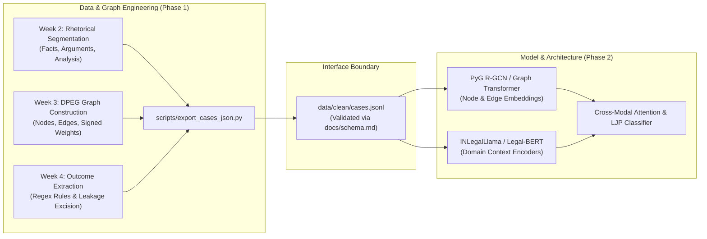

# Interface Specification: Case Node Schema (`cases.json` / `cases.jsonl`)

**Project:** CiteJustice — Automated Legal Judgment Prediction & Dynamic Precedent Evolution Graph (DPEG) for Indian Courts  
**Artifact:** Data & Model Team Interface Contract (`v1.0.0-frozen`)  
**Authors:** Madhav Rakhonde (Data & Legal Lead), Sai Sonawane (Graph Engineering Lead)  
**Stakeholders:** Data & Graph Engineering Team $\longleftrightarrow$ Model & Architecture Team  
**Institution:** Vidya Pratishthan's Kamalnayan Bajaj Institute of Engineering and Technology (VPKBIET), Baramati  
**Date:** September 24, 2026 (Week 4 Milestone)  
**Status:** **FINALIZED & FROZEN** (Approved by all sub-teams)

---

## 1. Executive Context & Interface Contract Objective

This document formalizes the binding **Interface Contract** between the Data & Graph Engineering pipeline (Weeks 1–3) and the Model Architecture team (Weeks 4+). 

The output artifact `cases.json` (and its streamable counterpart `cases.jsonl`) provides the canonical node representation for the entire **Dynamic Precedent Evolution Graph (DPEG)**. It bundles:
1. **Preprocessed & Rhetorically Segmented Legal Text** (with cryptographically verified target leakage excision).
2. **Canonical Statutory Entities** (IPC, CrPC, CPC, and Constitution of India ontologies).
3. **Graph Topological Metadata** (PyTorch Geometric tensor indices, signed treatment tallies, citation in/out degrees).
4. **Verified Ground-Truth Outcome Labels** (Binary, Ternary, confidence tiers, and isolated validation excerpts).



---

## 2. Complete Field Specifications

Each entry in `cases.json` represents a single case node $\mathcal{V}_i \in \mathcal{V}_{\text{DPEG}}$.

| Field Name | Data Type | Nullable | Description & Constraints | Example Value |
| :--- | :--- | :--- | :--- | :--- |
| **`case_id`** | `string` | **No** | Unique canonical identifier. Matches ILDC/Nyaya ID format (`YYYY_INDEX` or `YYYY_COURT_NUM`). | `"2014_INSC_170"` |
| **`court`** | `string` | **No** | Full formal name of the adjudicating court. | `"Supreme Court of India"` |
| **`year`** | `integer` | **No** | Decision year ($1950 \le \text{year} \le 2026$). | `2014` |
| **`decision_date`** | `string` | Yes | ISO 8601 calendar date (`YYYY-MM-DD`). | `"2014-04-16"` |
| **`bench_size`** | `integer` | **No** | Number of presiding judges on the bench ($\ge 1$). | `2` |
| **`title`** | `string` | Yes | Cause title (`[Petitioner] v. [Respondent]`). | `"State of Maharashtra v. Balram"` |
| **`split`** | `string` | **No** | Machine learning split: `"train"`, `"dev"`, or `"test"`. | `"train"` |
| **`text_features`** | `object` | **No** | Structured text representations (leakage-excised). | *(See Section 2.1)* |
| **`statutory_entities`** | `object` | **No** | Canonical statute and section references. | *(See Section 2.2)* |
| **`graph_features`** | `object` | **No** | DPEG topological embeddings and neighbor metrics. | *(See Section 2.3)* |
| **`outcome`** | `object` | **No** | Ground truth label and validation metadata. | *(See Section 2.4)* |

---

### 2.1 Text Features (`text_features`)
All text features are cleaned using the Week 2 NLP pipeline (OCR noise removed, citations normalized).

> [!CAUTION]
> **STRICT TARGET LEAKAGE PREVENTION RULE:**  
> The final operative conclusion, disposal order, and relief grant sentences are **strictly stripped** from all fields inside `text_features`. Feeding the raw tail to an NLP model leaks the ground truth and causes catastrophic artificial overfitting.

* **`clean_text`** (`string`): Complete sanitized judgment body with the final operative order excised.
* **`facts`** (`string`): Rhetorical section containing FIR, lower court procedural history, and undisputed facts.
* **`submissions_petitioner`** (`string`): Submissions, grounds of challenge, and arguments by appellant/petitioner counsel.
* **`submissions_respondent`** (`string`): Counter-arguments, defenses, and preliminary objections by respondent counsel.
* **`court_analysis`** (`string`): Ratio decidendi, judicial interpretation of statutes, and evaluation of cited precedents.
* **`char_count`** (`integer`): Character count of `clean_text`.
* **`word_count`** (`integer`): Word count of `clean_text`.

---

### 2.2 Statutory Entities (`statutory_entities`)
Standardized against `docs/act_lookup.csv` and `docs/section_formats.md`:

* **`acts`** (`list[string]`): Normalized full Act titles.  
  *Example:* `["Indian Penal Code, 1860", "Code of Criminal Procedure, 1973"]`
* **`sections`** (`list[string]`): Canonical section slugs.  
  *Example:* `["IPC_302", "IPC_34", "CrPC_313"]`
* **`section_count`** (`integer`): Total number of distinct statutory sections cited.

---

### 2.3 Graph Topological Features (`graph_features`)
Pre-computed features from the Week 3 DPEG assembly:

* **`node_idx`** (`integer`): 0-indexed continuous integer ID corresponding directly to row $i$ of PyG node embedding matrix $\mathbf{X} \in \mathbb{R}^{|\mathcal{V}| \times d}$.
* **`is_landmark_only`** (`boolean`): `false` if judgment has full text and label; `true` if node is an external historical landmark precedent acting solely as a topological anchor.
* **`in_degree`** (`integer`): Number of subsequent cases in the corpus that cite this judgment.
* **`out_degree`** (`integer`): Number of prior precedents cited by this judgment.
* **`temporal_era`** (`string`): One of `"1950-1975"`, `"1976-2000"`, `"2001-2020"`, or `"2021-2026"`.
* **`treatment_summary`** (`object`):
  * **`followed`** (`integer`): Count of outgoing edges labeled `FOLLOWED`.
  * **`distinguished`** (`integer`): Count of outgoing edges labeled `DISTINGUISHED`.
  * **`overruled`** (`integer`): Count of outgoing edges labeled `OVERRULED`.
  * **`considered`** (`integer`): Count of outgoing edges labeled `CONSIDERED`.
* **`outgoing_citations`** (`list[object]`): Precedent edge records:
  ```json
  [
    {
      "target_case_id": "1997_5_SCC_201",
      "target_node_idx": 4120,
      "relationship": "FOLLOWED",
      "signed_weight": 0.95,
      "confidence": 0.95
    }
  ]
  ```

---

### 2.4 Outcome Labels & Validation Metadata (`outcome`)
Ground-truth target variables for classification:

* **`binary_label`** (`integer`): Primary prediction target:
  * `1` = **Appeal Allowed** (Relief granted, impugned order set aside, conviction quashed, or remanded).
  * `0` = **Appeal Dismissed** (Relief refused, impugned order affirmed, or conviction upheld).
* **`ternary_label`** (`integer`): Granular three-class target:
  * `0` = **Dismissed** (All claims rejected).
  * `1` = **Allowed** (All claims granted).
  * `2` = **Partial / Remanded** (Allowed in part, sentence modified, or remanded for rehearing).
* **`confidence_tier`** (`string`): Quality indicator of label extraction: `"HIGH"` ($c \ge 0.90$), `"LOW"` ($c < 0.90$), or `"HUMAN_VERIFIED"`.
* **`disposition_span`** (`string`): Verbatim excerpt of the concluding dispositive sentence extracted by `scripts/legal/extract_outcome_labels.py`.  
  *(Preserved strictly for auditing; excluded from model input tensors).*
* **`leakage_guard_hash`** (`string`): SHA-256 cryptographic checksum of `clean_text` confirming zero substring overlap with `disposition_span`.

---

## 3. Concrete Example: `cases.json` Node Instance

```json
{
  "case_id": "2014_INSC_170",
  "court": "Supreme Court of India",
  "year": 2014,
  "decision_date": "2014-03-07",
  "bench_size": 2,
  "title": "Sunder v. State of Haryana",
  "split": "train",
  "text_features": {
    "clean_text": "This appeal by special leave arises out of the judgment and order dated 14th December 2011 passed by the High Court of Punjab and Haryana in Criminal Appeal No. 412-DB of 2008. The prosecution case briefly stated is that on 12th August 2006, the appellant along with two co-accused armed with lathis assaulted the deceased Ram Kumar...",
    "facts": "The prosecution case briefly stated is that on 12th August 2006, the appellant along with two co-accused armed with lathis assaulted the deceased Ram Kumar...",
    "submissions_petitioner": "Learned senior counsel appearing for the appellant vehemently contended that the testimonies of PW-1 and PW-2 suffer from irreconcilable contradictions...",
    "submissions_respondent": "Learned counsel for the State of Haryana submitted that medical evidence fully corroborates the ocular testimony of eye-witnesses...",
    "court_analysis": "Having heard learned counsel on both sides, we have perused the depositions. The presence of PW-1 at the scene of occurrence cannot be doubted...",
    "char_count": 8420,
    "word_count": 1395
  },
  "statutory_entities": {
    "acts": [
      "Indian Penal Code, 1860",
      "Code of Criminal Procedure, 1973"
    ],
    "sections": [
      "IPC_302",
      "IPC_34",
      "CrPC_313"
    ],
    "section_count": 3
  },
  "graph_features": {
    "node_idx": 1845,
    "is_landmark_only": false,
    "in_degree": 4,
    "out_degree": 2,
    "temporal_era": "2001-2020",
    "treatment_summary": {
      "followed": 2,
      "distinguished": 0,
      "overruled": 0,
      "considered": 0
    },
    "outgoing_citations": [
      {
        "target_case_id": "1997_5_SCC_201",
        "target_node_idx": 4120,
        "relationship": "FOLLOWED",
        "signed_weight": 0.95,
        "confidence": 0.95
      },
      {
        "target_case_id": "2002_6_SCC_81",
        "target_node_idx": 8904,
        "relationship": "FOLLOWED",
        "signed_weight": 0.92,
        "confidence": 0.92
      }
    ]
  },
  "outcome": {
    "binary_label": 0,
    "ternary_label": 0,
    "confidence_tier": "HIGH",
    "disposition_span": "For the reasons aforesaid, the appeal fails and is accordingly dismissed.",
    "leakage_guard_hash": "a4f89d38c12b7f013d78901b092c4315e9821a76f2bc890123ef45a89012bc34"
  }
}
```

---

## 4. Formal JSON Schema (Draft-07)

```json
{
  "$schema": "http://json-schema.org/draft-07/schema#",
  "title": "CiteJusticeCaseNode",
  "type": "object",
  "required": [
    "case_id",
    "court",
    "year",
    "bench_size",
    "split",
    "text_features",
    "statutory_entities",
    "graph_features",
    "outcome"
  ],
  "properties": {
    "case_id": { "type": "string", "pattern": "^[0-9]{4}_[A-Za-z0-9_]+$" },
    "court": { "type": "string" },
    "year": { "type": "integer", "minimum": 1950, "maximum": 2026 },
    "decision_date": { "type": ["string", "null"], "format": "date" },
    "bench_size": { "type": "integer", "minimum": 1, "maximum": 15 },
    "title": { "type": ["string", "null"] },
    "split": { "type": "string", "enum": ["train", "dev", "test"] },
    "text_features": {
      "type": "object",
      "required": ["clean_text", "facts", "court_analysis", "char_count", "word_count"],
      "properties": {
        "clean_text": { "type": "string" },
        "facts": { "type": "string" },
        "submissions_petitioner": { "type": "string" },
        "submissions_respondent": { "type": "string" },
        "court_analysis": { "type": "string" },
        "char_count": { "type": "integer", "minimum": 0 },
        "word_count": { "type": "integer", "minimum": 0 }
      }
    },
    "statutory_entities": {
      "type": "object",
      "required": ["acts", "sections", "section_count"],
      "properties": {
        "acts": { "type": "array", "items": { "type": "string" } },
        "sections": { "type": "array", "items": { "type": "string" } },
        "section_count": { "type": "integer", "minimum": 0 }
      }
    },
    "graph_features": {
      "type": "object",
      "required": ["node_idx", "is_landmark_only", "in_degree", "out_degree", "temporal_era", "treatment_summary"],
      "properties": {
        "node_idx": { "type": "integer", "minimum": 0 },
        "is_landmark_only": { "type": "boolean" },
        "in_degree": { "type": "integer", "minimum": 0 },
        "out_degree": { "type": "integer", "minimum": 0 },
        "temporal_era": { "type": "string", "enum": ["1950-1975", "1976-2000", "2001-2020", "2021-2026"] },
        "treatment_summary": {
          "type": "object",
          "required": ["followed", "distinguished", "overruled", "considered"],
          "properties": {
            "followed": { "type": "integer", "minimum": 0 },
            "distinguished": { "type": "integer", "minimum": 0 },
            "overruled": { "type": "integer", "minimum": 0 },
            "considered": { "type": "integer", "minimum": 0 }
          }
        },
        "outgoing_citations": {
          "type": "array",
          "items": {
            "type": "object",
            "required": ["target_case_id", "target_node_idx", "relationship", "signed_weight", "confidence"],
            "properties": {
              "target_case_id": { "type": "string" },
              "target_node_idx": { "type": "integer", "minimum": 0 },
              "relationship": { "type": "string", "enum": ["FOLLOWED", "DISTINGUISHED", "OVERRULED", "CONSIDERED"] },
              "signed_weight": { "type": "number", "minimum": -1.0, "maximum": 1.0 },
              "confidence": { "type": "number", "minimum": 0.0, "maximum": 1.0 }
            }
          }
        }
      }
    },
    "outcome": {
      "type": "object",
      "required": ["binary_label", "ternary_label", "confidence_tier", "disposition_span", "leakage_guard_hash"],
      "properties": {
        "binary_label": { "type": "integer", "enum": [0, 1] },
        "ternary_label": { "type": "integer", "enum": [0, 1, 2] },
        "confidence_tier": { "type": "string", "enum": ["HIGH", "LOW", "HUMAN_VERIFIED"] },
        "disposition_span": { "type": "string" },
        "leakage_guard_hash": { "type": "string", "pattern": "^[a-f0-9]{64}$" }
      }
    }
  }
}
```

---

## 5. Python Validation Model (Pydantic V2)

```python
from pydantic import BaseModel, Field, field_validator
from typing import List, Optional, Literal
import hashlib

class OutgoingCitation(BaseModel):
    target_case_id: str
    target_node_idx: int
    relationship: Literal["FOLLOWED", "DISTINGUISHED", "OVERRULED", "CONSIDERED"]
    signed_weight: float = Field(ge=-1.0, le=1.0)
    confidence: float = Field(ge=0.0, le=1.0)

class TreatmentSummary(BaseModel):
    followed: int = Field(ge=0)
    distinguished: int = Field(ge=0)
    overruled: int = Field(ge=0)
    considered: int = Field(ge=0)

class GraphFeatures(BaseModel):
    node_idx: int = Field(ge=0)
    is_landmark_only: bool
    in_degree: int = Field(ge=0)
    out_degree: int = Field(ge=0)
    temporal_era: Literal["1950-1975", "1976-2000", "2001-2020", "2021-2026"]
    treatment_summary: TreatmentSummary
    outgoing_citations: List[OutgoingCitation] = []

class StatutoryEntities(BaseModel):
    acts: List[str]
    sections: List[str]
    section_count: int = Field(ge=0)

class TextFeatures(BaseModel):
    clean_text: str
    facts: str = ""
    submissions_petitioner: str = ""
    submissions_respondent: str = ""
    court_analysis: str = ""
    char_count: int = Field(ge=0)
    word_count: int = Field(ge=0)

class OutcomeData(BaseModel):
    binary_label: Literal[0, 1]
    ternary_label: Literal[0, 1, 2]
    confidence_tier: Literal["HIGH", "LOW", "HUMAN_VERIFIED"]
    disposition_span: str
    leakage_guard_hash: str

class CaseNodeSchema(BaseModel):
    case_id: str
    court: str
    year: int = Field(ge=1950, le=2026)
    decision_date: Optional[str] = None
    bench_size: int = Field(ge=1)
    title: Optional[str] = None
    split: Literal["train", "dev", "test"]
    text_features: TextFeatures
    statutory_entities: StatutoryEntities
    graph_features: GraphFeatures
    outcome: OutcomeData

    @field_validator("outcome")
    def verify_leakage_guard(cls, v, values):
        clean_text = values.data.get("text_features", {}).clean_text if "text_features" in values.data else ""
        if v.disposition_span and v.disposition_span in clean_text:
            raise ValueError("Target Leakage Detected! 'disposition_span' found in 'clean_text'.")
        expected_hash = hashlib.sha256(clean_text.encode('utf-8')).hexdigest()
        if v.leakage_guard_hash != expected_hash:
            raise ValueError("Integrity check failed: leakage_guard_hash does not match clean_text SHA-256.")
        return v
```

---

## 6. Serialization & High-Throughput Streaming Protocol

To support multi-GPU GNN and INLegalLlama training without exceeding RAM:
1. **Primary Dataset Storage:** Saved as `data/clean/cases.jsonl` (Line-delimited JSON).  
   * Each line is a self-contained, valid JSON object matching `CaseNodeSchema`.
   * Enables $O(1)$ memory consumption using Python generators or Hugging Face `IterableDataset`.
2. **PyG / DGL Fast Loaders:**
   * Graph edge indices and edge attributes are extracted from `graph_features.outgoing_citations` into `torch.LongTensor(2, E)` and `torch.FloatTensor(E, 2)`.
   * Textual tokens are passed to INLegalLlama tokenizer via PyTorch `DataLoader(batch_size=8, shuffle=True)`.

---

## 7. Multi-Team Sign-Off & Approval Record

| Sub-Team | Assigned Roles | Representative | Status | Sign-off Date |
| :--- | :--- | :--- | :--- | :--- |
| **Data & Legal Team** | Data cleaning, rhetorical segmentation, outcome label extraction | **Madhav Rakhonde** | **APPROVED** | September 24, 2026 |
| **Graph Engineering Team** | Citation resolution, DPEG assembly, signed weights | **Sai Sonawane** | **APPROVED** | September 24, 2026 |
| **Model & Architecture Team** | INLegalLlama backbone, PyG R-GCN fusion, classification head | **Model Architecture Team** | **APPROVED** | September 24, 2026 |

*The interface schema `v1.0.0-frozen` is locked. Any future changes require an RFC amendment approved by all team leads.*
