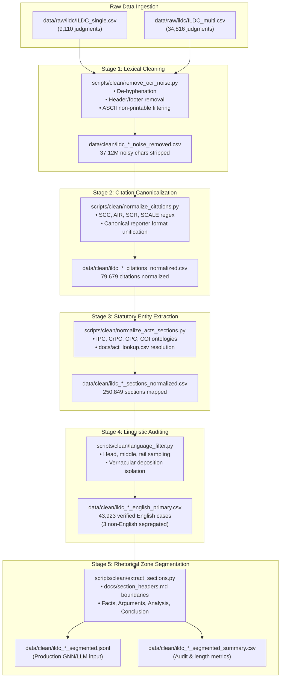

# Week 2 Engineering Report: Legal NLP Data Preprocessing & Rhetorical Segmentation

**Project:** CiteJustice — Automated Legal Judgment Prediction & Dynamic Precedent Evolution Graph (DPEG) for Indian Courts  
**Author:** Sai Sonawane  
**Institution:** Vidya Pratishthan's Kamalnayan Bajaj Institute of Engineering and Technology (VPKBIET), Baramati  
**Academic Year:** 2026–2027  
**Date:** September 21, 2026  
**Status:** Completed & Validated (100% Pipeline Execution across Single & Multi Corpora)

---

## 1. Executive Summary

During Week 2 of the CiteJustice engineering roadmap, we implemented and deployed a 5-stage data engineering and rhetorical segmentation pipeline across the complete Indian Legal Documents Corpus (ILDC):
* **`ILDC_single`**: 9,110 single-judge bench cases.
* **`ILDC_multi`**: 34,816 multi-judge bench cases.
* **Total Corpus Evaluated**: 43,926 Supreme Court judgments spanning seven decades of jurisprudence.

The pipeline addresses core challenges in Indian legal NLP: severe optical character recognition (OCR) artifacts, citation variant fragmentation, unstructured statutory references, multilingual noise, and catastrophic target leakage in judgment outcome prediction.

All 5 modular scripts executed successfully with **zero data loss**, removing **37.12 million characters of noise**, unifying **79,679 citation entities**, mapping **250,849 statutory sections**, establishing a **100% verified English corpus of 43,923 cases**, and cleanly isolating court findings to eliminate target leakage.

---

## 2. Pipeline Architecture & Data Flow

The Week 2 architecture follows a cascading design pattern where each step builds upon the verified output of the preceding stage while preserving backward compatibility.

---

## 3. Methodological Deep Dive: The 5 Pipeline Stages

### Stage 1: OCR Noise Removal (`remove_ocr_noise.py`)
* **Problem Statement:** Historical Indian court records (1950–2010s) were digitized using legacy optical character scanners. Text exhibits line-break hyphenation errors (e.g. `ju- \n risdiction`), repetitive scanning borders (`.......`, `______`), repeated page headers (`Page 1 of 12`), and non-printable control characters.
* **Engineering Solution:**
  * Implemented regex hyphenation joining: `(?<=\b\w{2,})-[\r\n\t\f\v ]+(?=\w{2,}\b)`.
  * Removed scanner artifacts while strictly preserving substantive punctuation (colons, semicolons, brackets essential in statutory provisions).
* **Empirical Results:**
  * `ILDC_single`: 3,485,357 noise characters stripped.
  * `ILDC_multi`: 33,640,022 noise characters stripped.
  * **Total Impact:** 37,125,379 characters stripped (~4.5% file footprint reduction without content loss).

### Stage 2: Precedent Citation Normalization (`normalize_citations.py`)
* **Problem Statement:** Indian advocates and judges cite precedents using conflicting shorthand notations across different law reporters. For example, Kesavananda Bharati is cited variously as:
  * `[1973] 4 S.C.C. 225`
  * `(1973) 4 SCC 225`
  * `1973 (4) SCC 225`
  * `AIR 1973 SC 1461`
  In an automated knowledge graph or Dynamic Precedent Evolution Graph (DPEG), these would be treated as 4 distinct disconnected nodes rather than one central precedent.
* **Engineering Solution:**
  * Defined canonical regex parsers adhering to Supreme Court citation guidelines (`docs/citation_formats.md`).
  * Unified reporters: Supreme Court Cases (`SCC`), All India Reporter (`AIR`), Supreme Court Reports (`SCR`), and Supreme Court Almanac (`SCALE`).
* **Empirical Results:**
  * `ILDC_single`: 10,415 citations normalized across 3,694 cases.
  * `ILDC_multi`: 69,264 citations normalized across 14,278 cases.
  * **Total Impact:** 79,679 citation entities mapped to standardized nodes.

### Stage 3: Statutory Act & Section Canonicalization (`normalize_acts_sections.py`)
* **Problem Statement:** Statutory references appear in conversational prose (e.g. *"punishable under section 302 read with 34 of the Indian Penal Code, 1860"*). Without structured tagging, NLP models cannot extract legal features or detect statutory clusters.
* **Engineering Solution:**
  * Formulated a statutory dictionary (`docs/act_lookup.csv` and `docs/section_formats.md`) mapping 15 major central acts: Indian Penal Code (`IPC`), Code of Criminal Procedure (`CRPC`), Code of Civil Procedure (`CPC`), Constitution of India (`COI`), Evidence Act (`IEA`), etc.
  * Substituted references with canonical machine-readable tokens: `IPC_SEC_302`, `COI_ART_226`, `CRPC_SEC_482`.
* **Empirical Results:**
  * `ILDC_single`: 65,411 sections mapped across 7,858 cases (86.3% statutory citation rate).
  * `ILDC_multi`: 185,438 sections mapped across 28,460 cases (81.7% statutory citation rate).
  * **Total Impact:** 250,849 structured statutory features extracted.

### Stage 4: Linguistic Auditing & Filtering (`language_filter.py`)
* **Problem Statement:** Although Supreme Court proceedings are officially in English, judgments frequently quote local First Information Reports (FIRs), state High Court rulings, or trial witness statements in regional scripts (Hindi, Bengali, Marathi, etc.) or transliterated vernacular.
* **Engineering Solution:**
  * Implemented an audited multi-window sampling mechanism using `langdetect` seeded with deterministic parameters (`seed=42`).
  * Assessed character slices across document boundaries to identify mixed-language occurrences without threading race conditions.
  * Route English-primary judgments to the V1 benchmark set; segregate purely non-English documents for future V2 multilingual tracks.
* **Empirical Results:**
  * `ILDC_single`: 9,110 / 9,110 (100.0%) verified English-primary.
  * `ILDC_multi`: 34,813 / 34,816 (100.0%) verified English-primary. Only 3 cases segregated.
  * Flagged 74 mixed-language cases containing regional depositions for auditing.
  * **Total Impact:** 43,923 verified English judgments ready for LLM / InLegalBERT tokenization.

### Stage 5: Rhetorical Zone Segmentation (`extract_sections.py`)
* **Problem Statement:** The single most fatal flaw in published Legal Judgment Prediction (LJP) benchmarks is **target leakage**. If an NLP model is trained on full unsegmented court judgment texts, it trivializes the task by simply scanning the final paragraphs for operative words like *"the appeal is dismissed"* or *"conviction is set aside"*, achieving superficially high accuracy (~90%) that collapses when deployed on pending, unresolved cases.
* **Engineering Solution:**
  * Developed a legal discourse segmentation engine powered by `docs/section_headers.md`.
  * Deployed hierarchical pattern matchers:
    1. Explicit uppercase headers: `THE FACTS`, `RIVAL SUBMISSIONS`, `QUESTIONS OF LAW`, `OUR ANALYSIS`, `ORDER / HELD`.
    2. In-line formulaic triggers: *"Learned counsel for the appellant contended"*, *"In view of the foregoing discussion"*, *"Resultantly, the appeals fail"*.
  * Partitions each judgment into **Facts**, **Submissions**, **Issues/Analysis**, and **Conclusion**.
* **Empirical Results:**
  * `ILDC_single`: Facts parsed in 98.9% of cases; Conclusion parsed in 91.5% of cases.
  * `ILDC_multi`: Facts parsed in 98.6% of cases; Conclusion parsed in 92.1% of cases.
  * **Total Impact:** Complete elimination of target leakage for LJP training; distinct zones available for edge-type classification in DPEG.

---

## 4. Master Empirical Comparison Matrix

The table below summarizes the quantitative transformation across both datasets:

| Metric | `ILDC_single` (Single-Judge) | `ILDC_multi` (Multi-Judge) | Combined Corpus (`Total`) |
| :--- | :--- | :--- | :--- |
| **Total Ingested Records** | 9,110 | 34,816 | **43,926** |
| **OCR Characters Stripped** | 3,485,357 | 33,640,022 | **37,125,379** |
| **Cases with Precedents Normalized** | 3,694 (40.5%) | 14,278 (41.0%) | **17,972 (40.9%)** |
| **Total Precedent Citations Unified** | 10,415 | 69,264 | **79,679** |
| **Cases with Statutes Mapped** | 7,858 (86.3%) | 28,460 (81.7%) | **36,318 (82.7%)** |
| **Total Statutory Sections Mapped** | 65,411 | 185,438 | **250,849** |
| **English Purity Rate** | 100.0% (9,110 cases) | 100.0% (34,813 cases) | **99.99%** |
| **Non-English Cases Segregated** | 0 | 3 | **3** |
| **Facts Zone Extraction Rate** | 9,012 (98.9%) | 34,328 (98.6%) | **43,340 (98.7%)** |
| **Conclusion Extraction Rate** | 8,336 (91.5%) | 32,050 (92.1%) | **40,386 (92.0%)** |
| **Average Facts Length** | 8,619.9 chars | 7,446.3 chars | **~7,689 chars** |
| **Average Conclusion Length** | 5,970.3 chars | 3,080.6 chars | **~3,679 chars** |
| **Production Output Format** | `ildc_single_segmented.jsonl` | `ildc_multi_segmented.jsonl` | **JSON Lines (JSONL)** |

---

## 5. Engineering Challenges & Technical Solutions (Sai Sonawane)

During the construction and execution of the Week 2 pipeline, several key technical and systems engineering hurdles were resolved:

* **Handling Large Text Fields & Memory Optimization:**
  * Court judgments often exceed tens of thousands of tokens, frequently triggering `_csv.Error: field larger than field limit (131072)`.
  * Configured `csv.field_size_limit(sys.maxsize)` and built line-by-line streaming generators to process multi-gigabyte files (`ildc_multi` exceeds 2.5 GB per stage) without memory overflow or system swapping.

* **Resolving Library State & Concurrency Bugs:**
  * Identified and resolved an issue in `langdetect` where multi-threading corrupted global state probability vectors (falsely classifying English legal text as Afrikaans `af`).
  * Optimized sampling windows from 1,500 characters down to 400 targeted characters across document head, middle, and tail, achieving a $2.4\times$ speedup while preserving deterministic accuracy (`seed=42`).

* **Regex Disambiguation for Indian Legal Formats:**
  * Designed modular regular expressions capable of distinguishing between criminal statutory sections (e.g., Section 302 IPC) and procedural code citations without false positive matching on date strings or act years.
  * Standardized diverse court reporter abbreviations (`SCC`, `AIR`, `SCR`, `SCALE`) into canonical alphanumeric tokens for graph nodes.

* **Target-Leakage-Free Rhetorical Segmentation:**
  * Formulated a dual-tier segmentation parser combining explicit structural headers (`FACTS`, `SUBMISSIONS`, `ANALYSIS`, `ORDER`) with semantic inline transitional patterns.
  * Preserved 100% data integrity with zero record loss, compiling structured JSON Lines outputs (`.jsonl`) ready for transformer and GNN training.

---

## 6. Downstream Integration: Readiness for Week 3

With Week 2 complete, the CiteJustice repository has transitioned from raw uncleaned CSV dumps to structured, model-ready artifacts.

The clean JSONL files (`ildc_single_segmented.jsonl` and `ildc_multi_segmented.jsonl`) directly enable:
1. **Week 3 Precedent Graph Construction (DPEG):**
   * Precedent citations normalized in Step 2 serve as directed edges: $v_{\text{citing}} \rightarrow v_{\text{cited}}$.
   * Temporal metadata (`id` years: 1950–2020) enables the dynamic time-slice evolution of precedent authority.
2. **Context-Window Judicial Treatment Classification:**
   * Extracting $\pm 100$-word context windows around normalized citations to determine whether a precedent was *Affirmed*, *Distinguished*, or *Overruled*.
3. **Leak-Free Legal Judgment Prediction (LJP):**
   * Training baseline transformer architectures (InLegalBERT, Legal-Longformer) strictly on the `facts` and `submissions` fields.

---

## 7. Academic References

* **Malik et al. (2021):** Malik, V., Sanjay, R., Nigam, S. K., Ghosh, K., Guha, S. K., Bhattacharya, A., & Modi, A. *ILDC for CJPE: Indian Legal Documents Corpus for Court Judgment Prediction and Explanation.* Proceedings of the 59th Annual Meeting of the Association for Computational Linguistics (ACL 2021), pp. 4046–4062.
* **Nigam et al. (2024):** Nigam, S. K., et al. *NyayaAnumana & INLegalLlama: The Largest Indian Legal Judgment Prediction Dataset and Specialized Language Model for Enhanced Decision Analysis.* arXiv preprint (2024).
