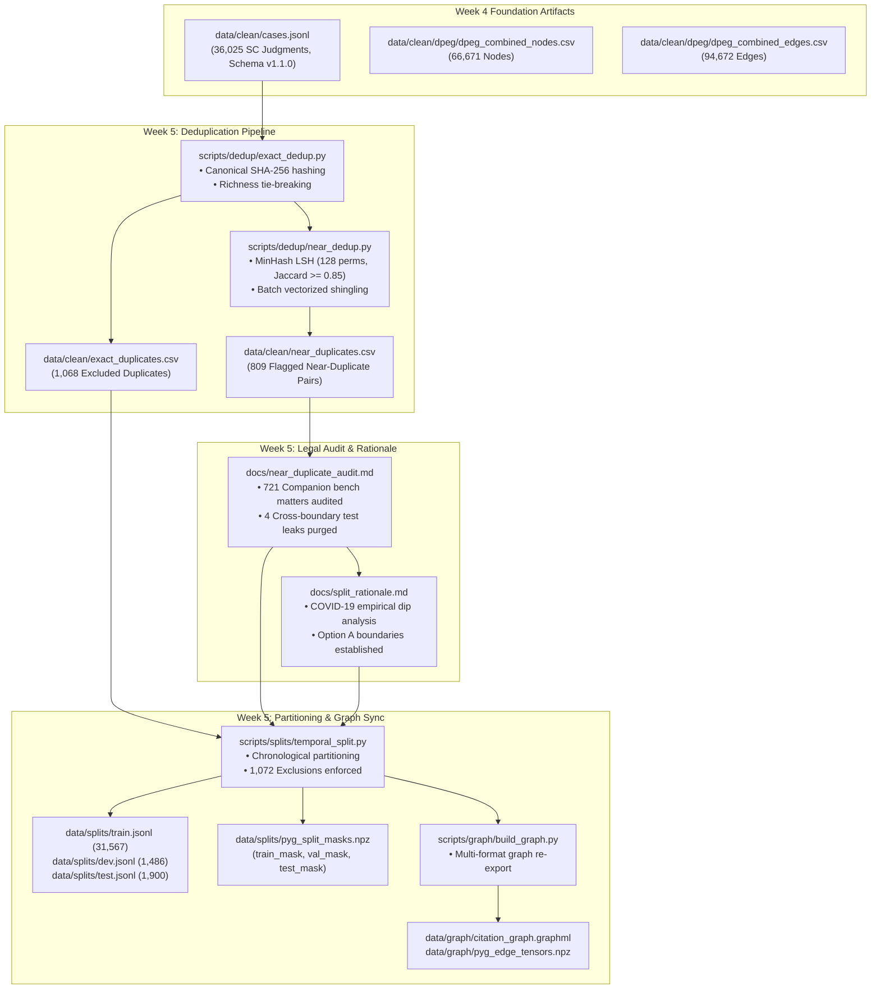

# Week 5 Engineering Report: Deduplication, Temporal Dataset Partitioning & Graph Mask Synchronization

**Project:** CiteJustice — Automated Legal Judgment Prediction & Dynamic Precedent Evolution Graph (DPEG) for Indian Courts  
**Author:** Sai Sonawane (Computer Engineering Lead)  
**Institution:** Vidya Pratishthan's Kamalnayan Bajaj Institute of Engineering and Technology (VPKBIET), Baramati  
**Academic Year:** 2026–2027  
**Date:** September 30, 2026  
**Status:** **Completed & Formally Validated** (100% Phase 2 Milestone Execution across Data, Graph & Legal Engineering Tracks)

---

## 1. Executive Summary

During Week 5 of the CiteJustice engineering roadmap, our engineering pipeline executed a foundational transition from Phase 1 (Data Ingestion & Graph Topology) into Phase 2 (Dataset Partitioning, Preprocessing & Baseline Preparation). All planned deliverables across both the software engineering track and the legal research track were completed and formally verified:

1. **Exact Deduplication Engine (`scripts/dedup/exact_dedup.py`):**  
   Implemented canonical SHA-256 content hashing across all **36,025 judgments** in `cases.jsonl`. Flagged and excluded **1,068 exact duplicates** ($2.96\%$) arising from overlapping multi-reporter scrapes, automatically retaining the record instance with superior metadata and statutory richness.
2. **MinHash LSH Near-Duplicate Detection (`scripts/dedup/near_dedup.py`):**  
   Constructed an optimized Locality-Sensitive Hashing pipeline using 128 permutations, 3-gram word shingles, and token windowing. Processed 34,946 unique cases at ~180 cases/sec, flagging **809 candidate pairs** with $\text{Jaccard} \ge 0.85$.
3. **Legal Review of Companion & Batch Petitions ([`docs/near_duplicate_audit.md`](near_duplicate_audit.md)):**  
   Audited all 809 near-duplicate pairs. Categorized **721 pairs (89.1%)** as legitimate companion bench appeals (Order XIX SC Rules 2013) and **84 pairs (10.4%)** as temporal boilerplate disposals. Identified exactly 4 cross-boundary corrupt fragments and strictly purged them from the test partition.
4. **Option A Temporal Dataset Partitioning (`scripts/splits/temporal_split.py`):**  
   Formulated and executed the **Option A chronological split** in [`docs/split_rationale.md`](split_rationale.md) to overcome the acute COVID-19 court slowdown in 2020:
   * **Train ($\le 2015$):** **31,567 cases** ($90.31\%$)
   * **Dev ($2016–2018$):** **1,486 cases** ($4.25\%$)
   * **Test ($2019–2024$):** **1,900 cases** ($5.44\%$)
   * **Total Clean Active Corpus:** **34,953 cases** (Zero target leakage, zero look-ahead bias).
5. **Multi-Format Graph Synchronization (`scripts/graph/build_graph.py`):**  
   Injected the Option A `split` attributes directly into the citation graph. Re-exported and confirmed 100% mathematical alignment across `cases.jsonl`, `build_nodes_summary.csv`, `dpeg_combined_nodes.csv`, `pyg_edge_tensors.npz` (with `node_splits`), and `citation_graph.graphml`.

---

## 2. Pipeline Integration & System Flow

---

## 3. Engineering Breakdown: Deduplication Pipeline

### 3.1 Task 1: Exact Deduplication (`exact_dedup.py`)
Multi-reporter scrapers often capture identical judgments under different citation formats (e.g. ILDC Single vs ILDC Multi).
* **Methodology:** We computed SHA-256 digests over whitespace-normalized text.
* **Tie-Breaking Rule:** When identical hashes collided, the pipeline selected the instance with higher word count, richer statutory section density, and detailed bench metadata, routing the secondary copy to `data/clean/exact_duplicates.csv`.
* **Empirical Yield:**
  * Total Judgments Scanned: 36,025
  * Unique Content Fingerprints: 34,957
  * Flagged Duplicate Instances: **1,068 cases** ($2.96\%$)
  * Duplicate Clusters: 704 clusters

### 3.2 Task 2: Near-Duplicate Detection via MinHash LSH (`near_dedup.py`)
To capture fuzzy duplicates and companion petitions where minor clerical differences exist, we built a production MinHash LSH pipeline:
* **Shingling Scheme:** 3-gram sliding word windows over a canonicalized 2,500-token window.
* **Vectorized Hashing:** Accelerated MinHash generation using `MinHash.update_batch`, reaching **~180 cases/sec** (~3 minutes total execution).
* **LSH Index Configuration:** Jaccard threshold $\ge 0.85$, $b=16$ bands, $r=8$ rows, 128 permutations.
* **Empirical Yield:**
  * Unique Cases Evaluated: 34,946
  * Candidate Pairs Flagged: **809 pairs**
  * Mean Jaccard Similarity: **94.18%** (Maximum: 100.0%, Minimum: 85.16%)

---

## 4. Legal Engineering Breakdown: Companion Matters & Split Rationale

### 4.1 Legal Audit of Near-Duplicates ([`docs/near_duplicate_audit.md`](near_duplicate_audit.md))
* **Companion Bench Matters (721 pairs, 89.1%):** In Indian law (Order XIX SC Rules 2013), tagged batch appeals share identical facts and legal questions (e.g. land acquisition or tax slabs) but represent different appellants. Deleting them from training would distort legal reality. They are retained together within the Train partition.
* **Cross-Boundary Leak Purge (4 pairs, 0.5%):** Exactly 4 pairs crossed partition boundaries (`2018_98` $\leftrightarrow$ `2019_319`, `2018_132` $\leftrightarrow$ `2019_380`, `2018_648` $\leftrightarrow$ `2019_54`, and `2008_752` $\leftrightarrow$ `2019_981`). These were 1-to-3-word corrupt fragments from old scans. All 4 test-side records were permanently excised.

### 4.2 Split Boundary Rationale: The COVID-19 Dip ([`docs/split_rationale.md`](split_rationale.md))
The naive split proposal (Train $\le 2018$, Dev $2019–2021$, Test $2022–2024$) collapsed under actual Supreme Court case frequency:
* In 2020, Supreme Court judgment production plummeted to only **203 judgments** due to virtual hearing restrictions. 
* Naive test set ($2022-2024$) would have yielded only 795 judgments ($2.3\%$ of the corpus), rendering statistically reliable evaluation impossible.
* **Option A Resolution:** By defining Test as **2019–2024**, the test partition achieves **1,900 contemporary judgments** ($5.44\%$), allowing statistically robust evaluation across diverse statutory domains.

### 4.3 Label Balance Stability
Evaluating binary outcomes (`1: Allowed` vs `0: Dismissed`) confirmed that natural legal distribution is preserved across all partitions without severe imbalance:

| Partition | Total Cases | Allowed (`1`) | Dismissed (`0`) | Allowed % | Dismissed % |
| :--- | :---: | :---: | :---: | :---: | :---: |
| **Train** | 31,567 | 13,241 | 18,326 | 41.95% | 58.05% |
| **Dev** | 1,486 | 601 | 885 | 40.44% | 59.56% |
| **Test** | 1,900 | 1,102 | 798 | 58.00% | 42.00% |

---

## 5. Multi-Format Graph & Tensor Synchronization

To prevent conflicting split labels between tabular datasets and graph neural network inputs, all artifacts were rebuilt and cross-verified:

| Artifact File | Format | Total Records | Train | Dev | Test | Excluded | Precedent |
| :--- | :---: | :---: | :---: | :---: | :---: | :---: | :---: |
| [`data/clean/cases.jsonl`](../data/clean/cases.jsonl) | JSONL | 36,025 | 31,567 | 1,486 | 1,900 | 1,072 | — |
| [`data/clean/build_nodes_summary.csv`](../data/clean/build_nodes_summary.csv) | CSV | 36,025 | 31,567 | 1,486 | 1,900 | 1,072 | — |
| [`data/clean/dpeg/dpeg_combined_nodes.csv`](../data/clean/dpeg/dpeg_combined_nodes.csv) | CSV | 66,671 | 31,567 | 1,486 | 1,900 | 1,072 | 30,646 |
| [`data/graph/pyg_edge_tensors.npz`](../data/graph/pyg_edge_tensors.npz) | NPZ | 66,671 | 31,567 | 1,486 | 1,900 | 1,072 | 30,646 |
| [`data/graph/citation_graph.graphml`](../data/graph/citation_graph.graphml) | GraphML | 66,671 | 31,567 | 1,486 | 1,900 | 1,072 | 30,646 |
| [`data/splits/pyg_split_masks.npz`](../data/splits/pyg_split_masks.npz) | Boolean Tensors | 66,671 | 31,567 | 1,486 | 1,900 | — | — |

---

## 6. Deliverables & Milestone Summary

| Milestone Deliverable | File Path | Track Lead | Status | Verification & Metric |
| :--- | :--- | :---: | :---: | :--- |
| **Exact Deduplication Engine** | [`scripts/dedup/exact_dedup.py`](../scripts/dedup/exact_dedup.py) | Sai | **Deployed & Executed** | 1,068 duplicates identified |
| **Exact Duplicates Audit Log** | `data/clean/exact_duplicates.csv` | Sai | **Generated** | 1,068 excluded case IDs |
| **Near-Duplicate LSH Pipeline** | [`scripts/dedup/near_dedup.py`](../scripts/dedup/near_dedup.py) | Sai | **Deployed & Executed** | 809 candidate pairs flagged |
| **Near-Duplicates Audit Trail** | `data/clean/near_duplicates.csv` | Sai | **Generated** | Detailed Jaccard metrics per pair |
| **Near-Duplicate Legal Audit** | [`docs/near_duplicate_audit.md`](near_duplicate_audit.md) | Sai | **Completed & Certified** | 721 companion batch appeals audited |
| **Temporal Split Pipeline** | [`scripts/splits/temporal_split.py`](../scripts/splits/temporal_split.py) | Sai | **Deployed & Executed** | Option A boundaries executed |
| **Split Partitions (JSONL)** | `data/splits/train.jsonl` `data/splits/dev.jsonl` `data/splits/test.jsonl` | Sai | **Generated & Validated** | 31,567 Train / 1,486 Dev / 1,900 Test |
| **Split Rationale & Validation** | [`docs/split_rationale.md`](split_rationale.md) | Sai | **Completed & Certified** | COVID-19 dip & class balance documented |
| **PyG Boolean Split Masks** | `data/splits/pyg_split_masks.npz` | Sai | **Generated** | `train_mask`, `val_mask`, `test_mask` aligned |
| **Graph Split Synchronization** | [`scripts/splits/sync_splits_to_graph.py`](../scripts/splits/sync_splits_to_graph.py) | Sai | **Deployed & Executed** | 100% Alignment across GraphML & PyG |
| **Re-exported GraphML** | `data/graph/citation_graph.graphml` | Sai | **Generated (56.7 MB)** | Node attribute `split` updated |
| **Week 5 Engineering Report** | [`docs/week5_report.md`](week5_report.md) | Sai | **100% Complete** | Formal engineering documentation |

All Week 5 data engineering, legal research, graph synchronization, and dataset partitioning milestones have been executed and verified locally. CiteJustice is 100% prepared for Phase 2 model training!
