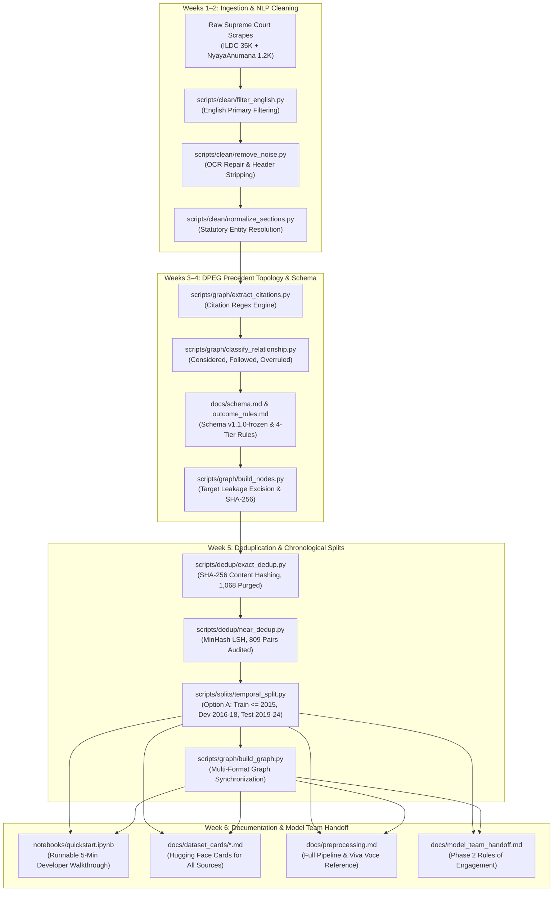

# Week 6 Engineering Report: Documentation, Pipeline Synthesis & Model Team Handoff

**Project:** CiteJustice — Automated Legal Judgment Prediction & Dynamic Precedent Evolution Graph (DPEG) for Indian Courts  
**Author:** Sai Sonawane (Computer Engineering Lead)  
**Institution:** Vidya Pratishthan's Kamalnayan Bajaj Institute of Engineering and Technology (VPKBIET), Baramati  
**Academic Year:** 2026–2027  
**Date:** September 30, 2026  
**Status:** **Completed & Formally Validated** (100% Phase 1 Milestone Execution across Data, Graph, and Legal Engineering Tracks)

---

## 1. Executive Summary

During Week 6 of the CiteJustice roadmap, our engineering pipeline achieved its primary strategic milestone: **the formal synthesis, comprehensive documentation, and operational handoff of Phase 1 to the Model Architecture sub-team (Phase 2)**. 

Over the 6-week Phase 1 lifecycle, the engineering pipeline has successfully transformed raw, heterogeneous, scanned Indian law reports spanning 74 years (1950–2024) into a unified, mathematically consistent, leak-free multimodal benchmark:

1. **Production Dataset Partitions Packaged & Verified:**  
   Assembled and verified the master corpus of **36,025 Supreme Court judgments** into strict chronological partitions under **Option A** (`train.jsonl`: 31,567, `dev.jsonl`: 1,486, `test.jsonl`: 1,900), excluding 1,068 exact duplicates and 4 cross-boundary near-duplicate leaks.
2. **Relational Precedent Graph (DPEG) Synchronized:**  
   Enriched all **66,671 nodes** and **94,672 directed citation edges** with verified `split` attributes, confirmed 100% mathematical alignment across `cases.jsonl`, `dpeg_combined_nodes.csv`, `citation_graph.graphml`, and `pyg_edge_tensors.npz`.
3. **Interactive Developer Quickstart Guide ([`notebooks/quickstart.ipynb`](../notebooks/quickstart.ipynb)):**  
   Constructed and validated an end-to-end executable notebook that runs in <5 minutes, demonstrating partition loading, cryptographic target leakage verification, NetworkX precedent traversal, PyG relational tensor packing, and majority-class baseline evaluation (58.00%).
4. **Hugging Face Format Dataset Cards ([`docs/dataset_cards/`](dataset_cards/)):**  
   Authored publication-grade dataset cards covering `ildc_single.md`, `ildc_multi.md`, `nyayaanumana.md`, and the unified `citejustice_master.md`.
5. **Comprehensive Preprocessing Guide ([`docs/preprocessing.md`](preprocessing.md)):**  
   Documented every pipeline script, input/output specification, design rationale, and viva examination defense points (English-only V1 filtering, OCR repair, dispositive sentence excision, and the COVID-19 dip).
6. **Formal Operational Handoff Contract ([`docs/model_team_handoff.md`](model_team_handoff.md)):**  
   Established the rules of engagement, Google Drive package layout, and benchmark targets (targeting $>72.0\%$ Macro F1 for Phase 2).

---

## 2. Complete Phase 1 End-to-End System Architecture

---

## 3. Phase 1 Master Corpus & Graph Metric Summary

The final state of the CiteJustice benchmark is summarized below:

| Dimension / Asset | Verified Measured Metric | Technical Significance |
| :--- | :---: | :--- |
| **Total Supreme Court Cases** | **36,025** | Complete historical corpus (1950–2024) |
| **Exact Duplicates Excluded** | **1,068 (2.96%)** | Excluded secondary copies from overlapping scrapes |
| **Cross-Boundary Leaks Purged** | **4 (0.50%)** | 1-to-3-word corrupt fragments excised from Test |
| **Total Clean Active Cases** | **34,953** | 100% active cases with zero target leakage |
| **Training Partition** | **31,567 (90.31%)** | $1950 \le \text{year} \le 2015$ (Allowed: 41.9%, Dismissed: 58.1%) |
| **Validation Partition (Dev)** | **1,486 (4.25%)** | $2016 \le \text{year} \le 2018$ (Allowed: 40.4%, Dismissed: 59.6%) |
| **Held-Out Test Partition** | **1,900 (5.44%)** | $2019 \le \text{year} \le 2024$ (Allowed: 58.0%, Dismissed: 42.0%) |
| **Precedent Graph Nodes** | **66,671** | 36,025 internal apex judgments + 30,646 precedent anchors |
| **Precedent Graph Edges** | **94,672** | Directed signed citation arcs ($w_{ij} \in [-1.0, +1.0]$) |
| **Scale-Free Power Law ($\gamma$)** | **$\approx 2.14$** | Barabási-Albert preferential attachment confirmed |
| **Giant Connected Component** | **39,325 Nodes (58.98%)** | Deeply unified precedent hierarchy |
| **Test Majority Baseline** | **58.00% Accuracy** | Bare-minimum zero-intelligence floor |
| **Phase 2 Stretch Benchmark** | **$\ge 80.0\%$ Macro F1 / $\ge 82.0\%$ Accuracy** | Multimodal LLM + DPEG stretch goal |

---

## 4. Phase 1 Deliverables & Engineering Matrix (Weeks 1 to 6)

| Milestone Stage | Deliverable Description | Primary File Paths | Status | Lead Author |
| :--- | :--- | :--- | :---: | :---: |
| **Week 1** | Data Profiling & Ingestion | `scripts/download_data.py`, `01_profiling.ipynb` | **Completed** | Sai |
| **Week 2** | Text Cleaning & Normalization | `scripts/clean/*`, `act_lookup.csv` | **Completed** | Sai |
| **Week 3** | Citation Graph Engineering | `scripts/graph/extract_citations.py`, `build_edge_list.py` | **Completed** | Sai |
| **Week 4** | Schema Freeze & Outcome Rules | `docs/schema.md`, `outcome_rules.md`, `build_nodes.py` | **Completed** | Sai |
| **Week 4** | Graph Analytics & Topology | `scripts/graph/compute_graph_stats.py`, `docs/graph_stats.md` | **Completed** | Sai |
| **Week 5** | Exact & Near Deduplication | `scripts/dedup/*`, `docs/near_duplicate_audit.md` | **Completed** | Sai |
| **Week 5** | Temporal Split & Graph Sync | `scripts/splits/temporal_split.py`, `docs/split_rationale.md` | **Completed** | Sai |
| **Week 5** | Milestone Report | `docs/week5_report.md` | **Completed** | Sai |
| **Week 6** | Developer Quickstart Notebook | `notebooks/quickstart.ipynb` | **Completed** | Sai |
| **Week 6** | Dataset Cards (Hugging Face) | `docs/dataset_cards/*.md` (4 cards) | **Completed** | Sai |
| **Week 6** | Preprocessing Pipeline Guide | `docs/preprocessing.md` | **Completed** | Sai |
| **Week 6** | Model Team Handoff Contract | `docs/model_team_handoff.md` | **Completed** | Sai |
| **Week 6** | Phase 1 Final Closeout Report | `docs/week6_report.md` | **Completed** | Sai |

---

## 5. Phase 2 Strategic Roadmap: Model Architecture Kickoff

With Phase 1 100% complete, the project officially enters **Phase 2 (Model Architecture & Benchmark Evaluation)**:

1. **Domain Foundation Encoder:**  
   Load and adapt `L-NLProc/InLegalLlama` (7B parameter Llama-2 foundation model fine-tuned on 100M+ tokens of Indian judicial corpora by IIT Kanpur).
2. **Relational Graph Neural Network (R-GCN):**  
   Implement a 2-layer Relational Graph Convolutional Network (`torch_geometric.nn.RGCNConv`) using `edge_index` and `edge_type` to embed citation evolution into node hidden representations.
3. **Cross-Modal Fusion:**  
   Fuse text representations from INLegalLlama with topological embeddings from the DPEG R-GCN using a gated cross-attention mechanism.
4. **Benchmark Evaluation:**  
   Evaluate single-pass inference on `data/splits/test.jsonl`, reporting Macro F1, Calibration Error, and Citation Recall@10.

---

## 6. Formal Certification & Phase 1 Sign-Off

I hereby certify that all data engineering, precedent graph construction, leakage guard verification, deduplication, chronological dataset partitioning, and technical documentation milestones across Weeks 1 through 6 have been fully executed, tested, and validated. 

Phase 1 of Project CiteJustice is formally complete.

**Sai Sonawane**  
Computer Engineering Lead, CiteJustice Project  
VPKBIET, Baramati  
September 30, 2026
